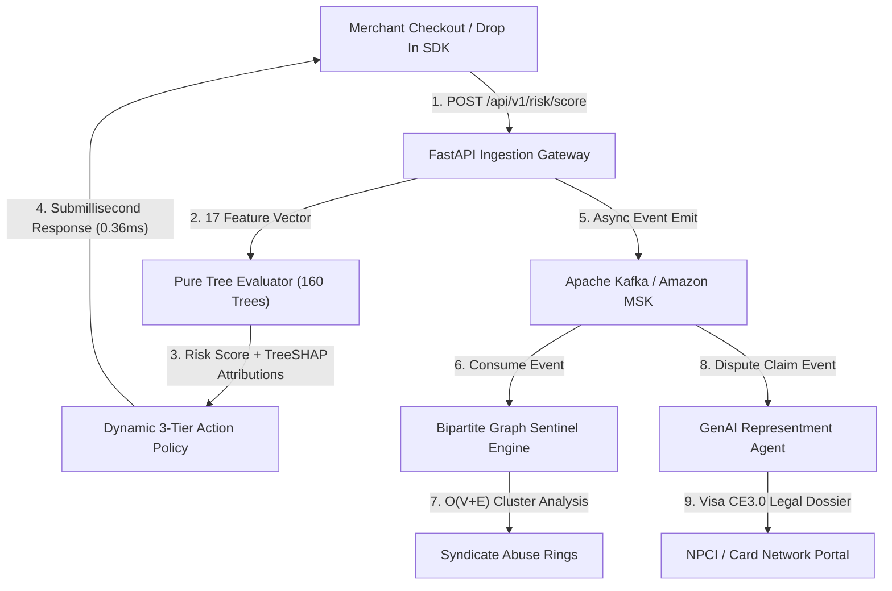
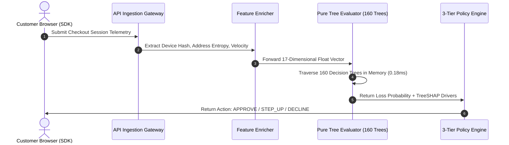
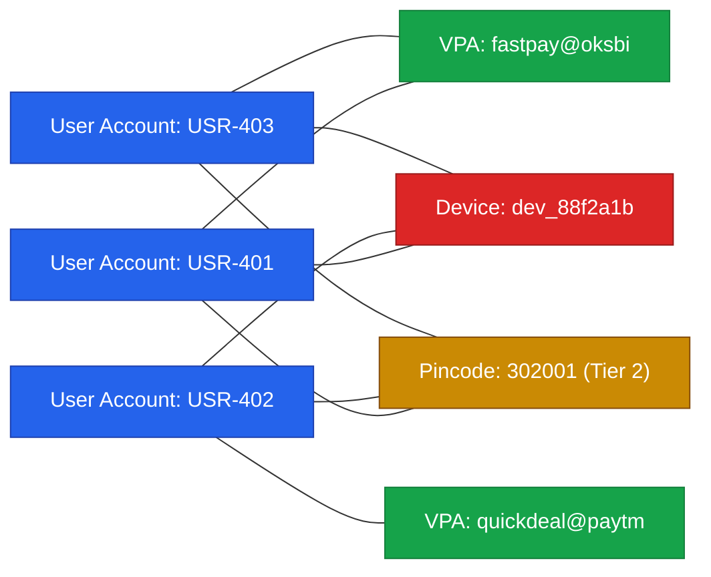

# SentinelRisk System Architecture and Design Document

## 1. High Level System Topology

The platform separates real time transaction evaluation (Synchronous Hot Path) from asynchronous graph intelligence and dispute automation (Asynchronous Stream Path).

## 2. Synchronous Hot Path Sequence

## 3. Bipartite Graph Syndicate Architecture

## 4. Multi Layer Defense Model

| Stage | Trigger Condition | Operational Action | Customer Experience |
| :--- | :--- | :--- | :--- |
| Tier 1: Frictionless Pass | Risk Score below 0.25 | Allow standard Cash on Delivery or Prepaid | Zero checkout interruption |
| Tier 2: Conditional Friction | Risk Score 0.25 to 0.70 | Trigger refundable INR 5 UPI Pre-Auth or SMS Delivery OTP | 15 second interactive verification |
| Tier 3: Terminal COD Restriction | Risk Score above 0.70 OR Linked to Active Syndicate Ring | Disable Cash on Delivery, require 100% upfront prepaid settlement | Prevents uncollected courier shipping losses |
